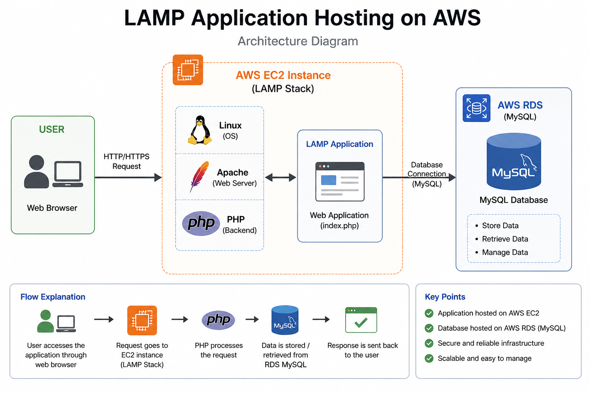
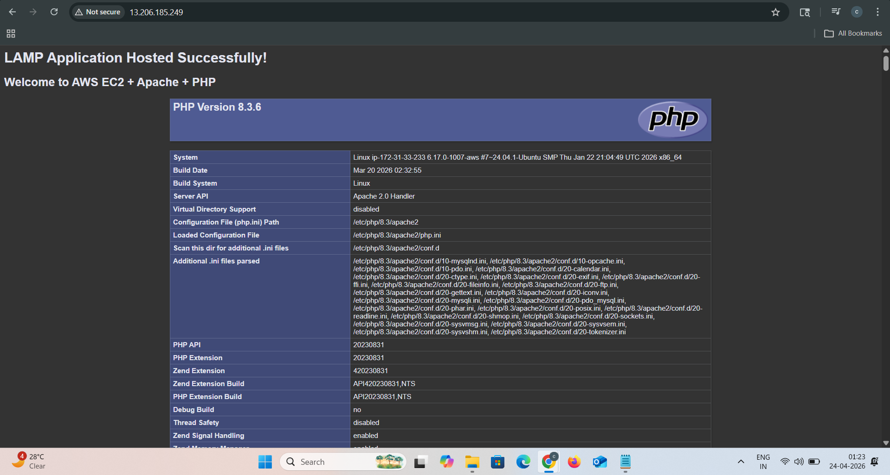
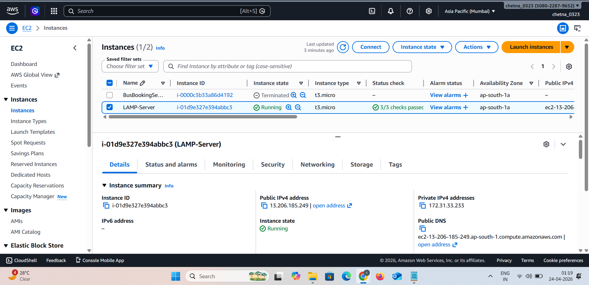
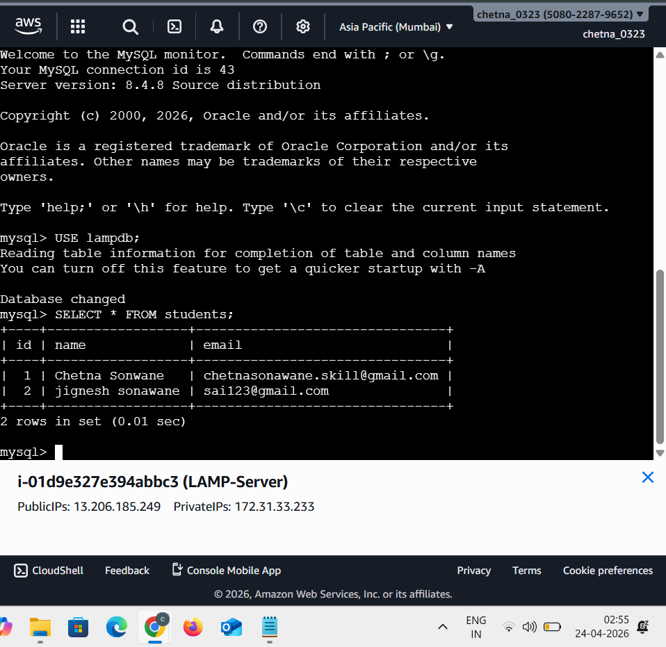
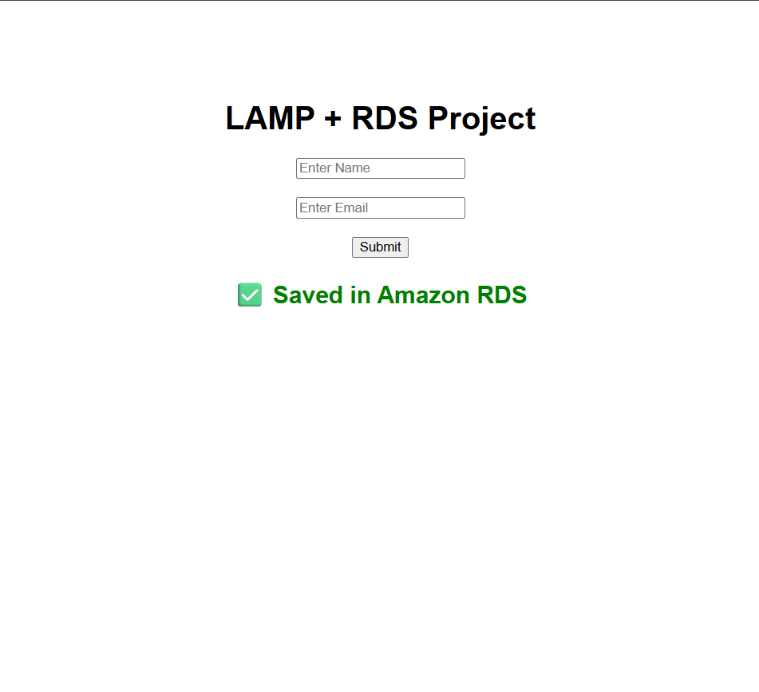

🚀 LAMP Application Hosting on AWS


---

📌 Project Overview

This project demonstrates hosting of a **LAMP (Linux, Apache, MySQL, PHP) application** on AWS.
The application is deployed on an EC2 instance and connected to an RDS database.

⚠️ *Note: AWS resources were terminated to avoid billing. Screenshots are provided as proof of successful deployment.*

---

🎯 Purpose

* Host a traditional web application
* Use EC2 for server hosting
* Connect application to cloud database (RDS)

---

🧰 Tech Stack

* Linux (Ubuntu EC2)
* Apache (Web Server)
* PHP (Backend)
* MySQL (RDS Database)
* AWS EC2
* AWS RDS

---

🏗️ Architecture Diagram



This shows: **User → EC2 (Apache + PHP) → RDS (MySQL Database)**

---

🌐 Application Output



This confirms that the LAMP application is successfully hosted.

---

⚙️ EC2 Instance (LAMP Server)



EC2 instance running Apache + PHP server.

---

🗄️ RDS Database Connection



Database stores user data submitted from the application.

---

🔍 Application Working



Shows form submission and data stored in RDS.

---

📂 Source Code

🔗 https://github.com/chetna0323/LAMP-Application-Hosting

---

🔥 Key Features

* LAMP stack deployment
* Cloud database integration (RDS)
* Real-time data storage
* Traditional web application hosting
* AWS-based architecture

---

📁 Project Structure

```id="lampstruct01"
LAMP-Application-Hosting/
│── index.php
│── db.php
│── README.md
│── screenshots/
│   ├── app-output.png
│   ├── ec2.png
│   ├── database.png
│   ├── app-working.png
│   └── architecture.png
```


